# Foodora — product specification

Foodora lets a hungry customer find a restaurant, build an order and have it delivered, without
creating an account. This is what the product team asked for. It describes intended behaviour —
the live app at [foodora.lovable.app](https://foodora.lovable.app/) is the build under test.

Each story has an ID (`FD-01` … `FD-08`). Quote the ID in test names, plans and bug reports, so
everyone can trace a test back to the requirement it checks.

---

## FD-01 · Browse restaurants

**As a customer, I want to see which restaurants deliver, so that I can pick where to order from.**

The landing page (`/`) lists the restaurants under **Popular Restaurants**.

- Each restaurant card shows the name, the cuisines, the rating, the delivery time range and the
  delivery fee (or **Free**).
- A card shows the restaurant's current promotion when it has one — for example
  *20% OFF orders over $25*.
- Selecting a card opens that restaurant's page.
- **View All** shows the full list of restaurants.

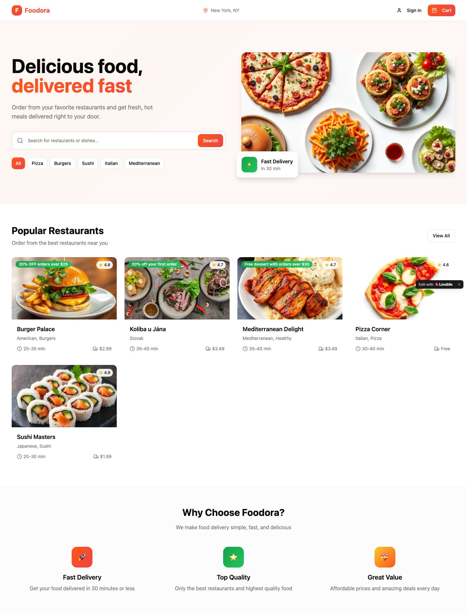

---

## FD-02 · Search and filter

**As a customer, I want to narrow the list down, so that I find what I am in the mood for quickly.**

- The search box finds restaurants by **restaurant name** or by **dish name**. *"Classic Beef"*
  finds the restaurant that serves the Classic Beef Burger.
- Search ignores upper and lower case: *burger* and *BURGER* give the same result.
- Results update while the customer types; pressing **Search** gives the same result.
- The cuisine chips (**All**, **Pizza**, **Burgers**, **Sushi**, **Italian**, **Mediterranean**)
  show only restaurants serving that cuisine. **All** shows every restaurant.
- A search and a selected cuisine chip apply **together**: with **Pizza** selected, searching
  *burger* shows only restaurants that match both.
- When nothing matches, the page says so — *No restaurants found* — with a hint to try another
  search or filter.

| Pizza filter | Search: burger | Nothing found |
| --- | --- | --- |
| 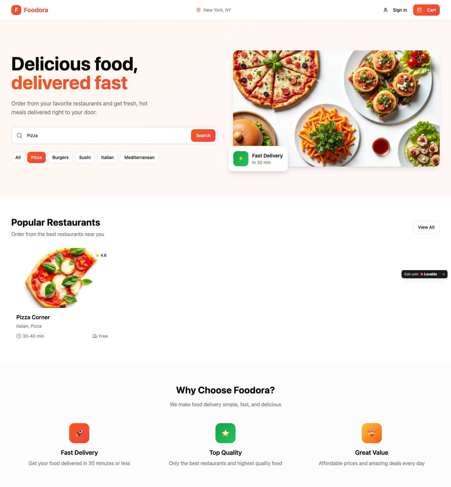 | 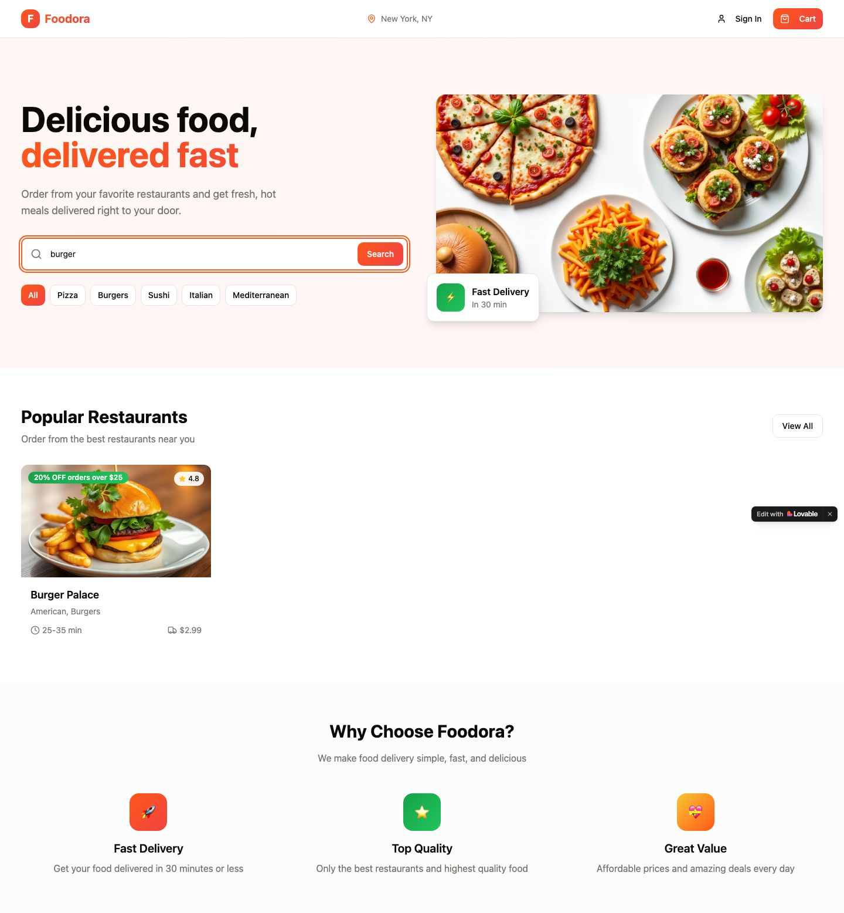 | 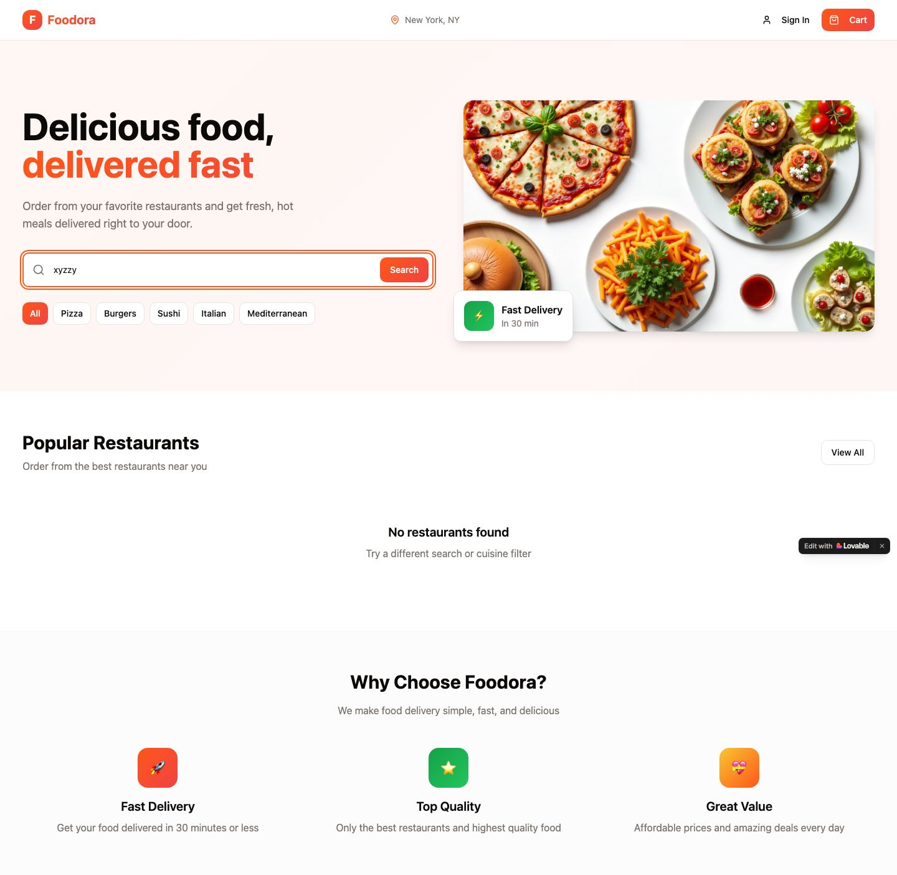 |

---

## FD-03 · Restaurant menu

**As a customer, I want to see a restaurant's menu, so that I can choose what to eat.**

The restaurant page (`/restaurant/<id>`) shows:

- the restaurant's name, cuisines, rating, delivery time, delivery fee and promotion;
- the menu, grouped into category tabs (for example *Burgers*, *Sides*, *Drinks*);
- for each dish: name, short description and price, and a quick-add **+** button.

Rules:

- Quick-add puts one of that dish into the cart and confirms it. The cart count in the header
  goes up by one.
- Selecting the dish itself opens its detail page (FD-04).
- Every button can be used with a screen reader: each one has an accessible name that says what
  it does, including icon-only buttons such as quick-add.

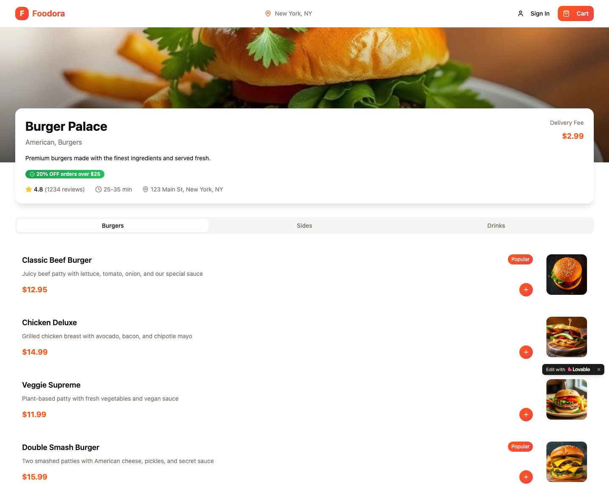

---

## FD-04 · Customise a dish

**As a customer, I want to adjust a dish before I order it, so that I get it the way I like it.**

The dish page (`/product/<id>`) shows the photo, description, rating, preparation time and calories.

- **Size** — pick exactly one (for example *Regular* or *Large +$3.00*).
- **Add-ons** — pick **any combination**, including none (for example *Extra Cheese* **and**
  *Bacon*).
- **Quantity** — 1 or more.
- The **Add to Cart** button shows the price of what is configured, and updates as the customer
  changes size, add-ons or quantity.
- Tabs show *Ingredients*, *Reviews* and *Nutrition*.
- The cart is reachable from this page, the same as from every other page in the order flow.

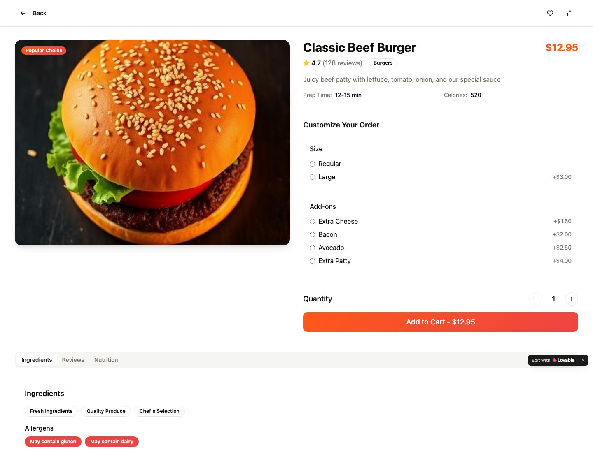

---

## FD-05 · Cart

**As a customer, I want to review and adjust my order before I pay, so that I only pay for what
I want.**

The cart opens as a panel from the **Cart** button in the header. The button shows how many items
are in the cart.

- Each line shows the dish, the restaurant, the price and a quantity stepper (**−** / **+**), and a
  way to remove it. **Clear Cart** removes everything.
- The summary shows **Subtotal**, **Delivery Fee**, **Service Fee** and **Total**, and
  Total = Subtotal − discount + Delivery Fee + Service Fee.
- The **Delivery Fee** is the fee the restaurant advertises — **Free** means $0.00.
- The **Service Fee** is a flat $1.50 per order.
- A restaurant promotion is applied automatically when the order qualifies. *20% OFF orders over
  $25* takes 20 % off the subtotal once it passes $25, and the discount shows as its own line.
- **Proceed to Checkout** takes the customer to checkout.
- An empty cart says so, offers a way back to the restaurants, and offers **no** way to check out.
- The cart survives a page reload: refreshing the browser does not lose the order.

| One item | Several items | Empty |
| --- | --- | --- |
| 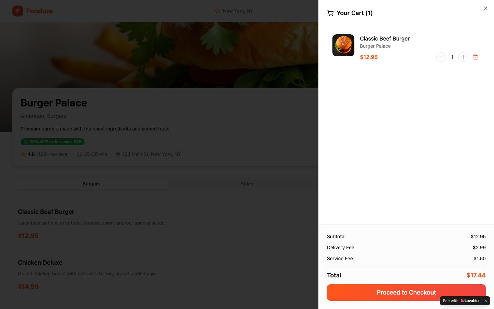 | 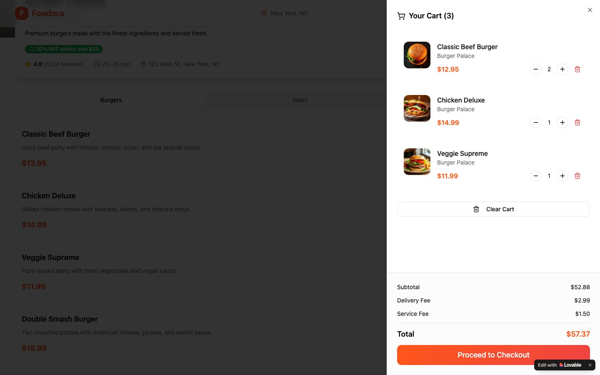 | 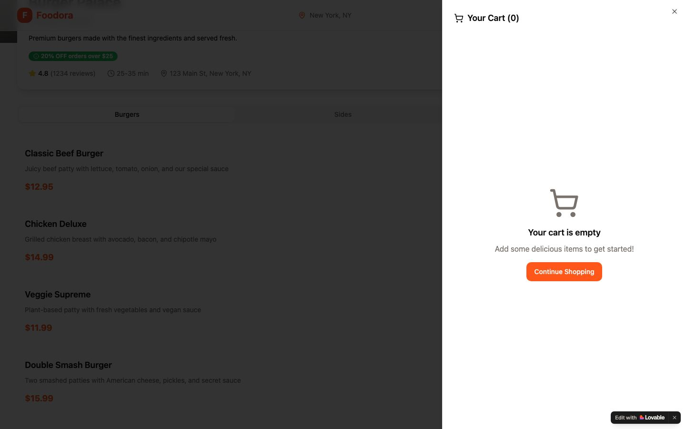 |

---

## FD-06 · Checkout

**As a customer, I want to tell Foodora where to deliver and how I pay, so that my order arrives.**

The checkout page (`/checkout`) has a **Delivery Address** form, a **Payment Method** choice and
an **Order Summary** with the same lines as the cart.

| Field | Required |
| --- | --- |
| Full Name | **yes** |
| Street Address | **yes** |
| Apt / Suite | no |
| City | **yes** |
| Phone Number | **yes** |
| Delivery Instructions | no |

- Payment method is one of **Credit / Debit Card** (selected by default), **Cash on Delivery** or
  **Apple Pay**.
- **Place Order** only places the order when every required field is filled in. Otherwise no order
  is placed, and each missing field shows a message saying what is needed.
- Opening checkout with an empty cart shows an empty state with a way back to the restaurants —
  never a form that could place an empty order.

| Blank form | Filled in |
| --- | --- |
| 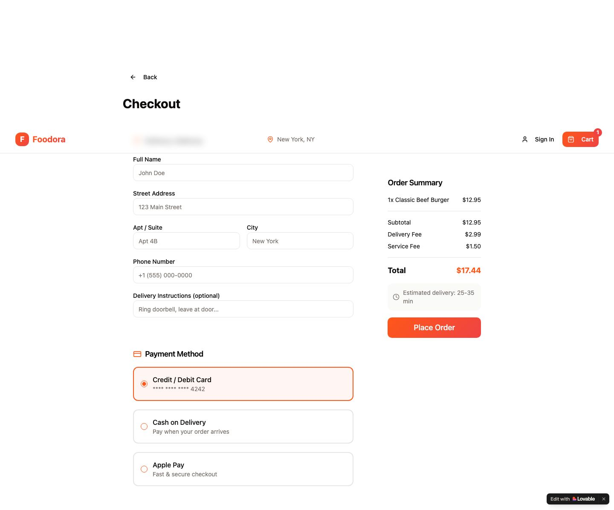 | 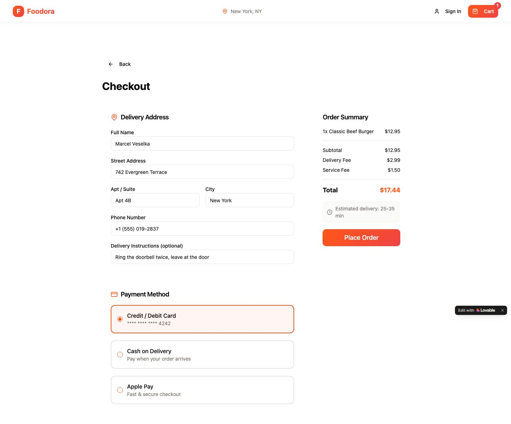 |

---

## FD-07 · Confirmation and tracking

**As a customer, I want to know my order went through and where it is, so that I am not left
guessing.**

After **Place Order**:

- The customer sees **Order Confirmed!**, a line saying the order was placed, the estimated
  delivery time, the order number and the total.
- Order numbers look like `FDR-` followed by six letters or digits, and every order gets a new one.
- **Track My Order** opens the tracking page; **Back to Home** returns to the landing page.

The tracking page (`/order/<order number>`) shows:

- the order number, the **total paid** and the estimated delivery;
- five stages in order: *Order Confirmed → Preparing → Ready for Pickup → On the Way → Delivered*.

Rules:

- Tracking works only for real orders. An order number that was never placed does not show a
  tracking page.
- **Total paid** is the amount of the placed order. It cannot be changed by editing the address in
  the browser.

| Confirmation | Tracking |
| --- | --- |
| 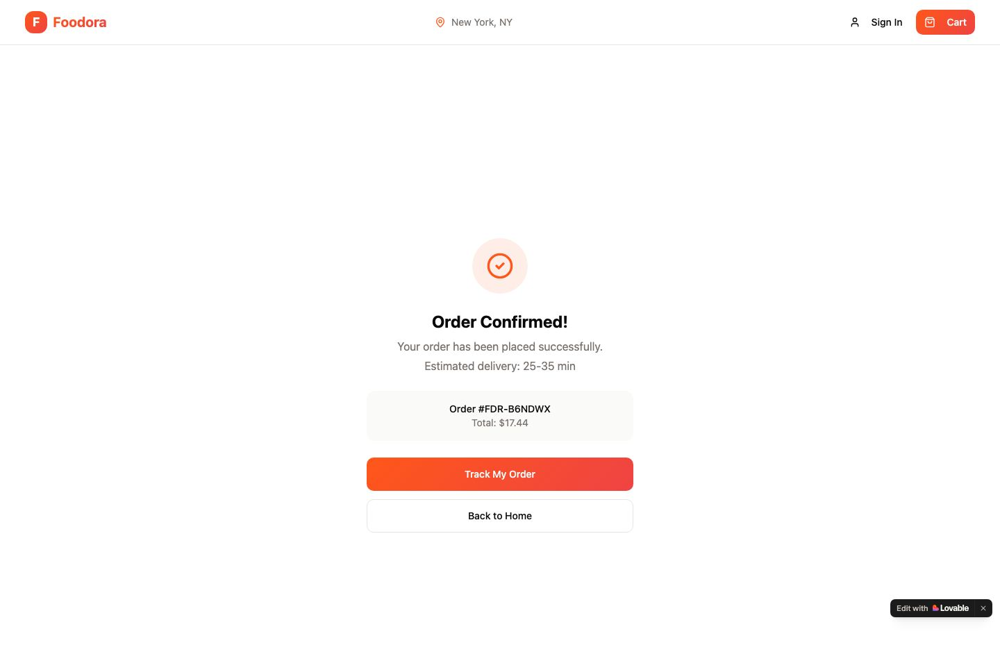 | 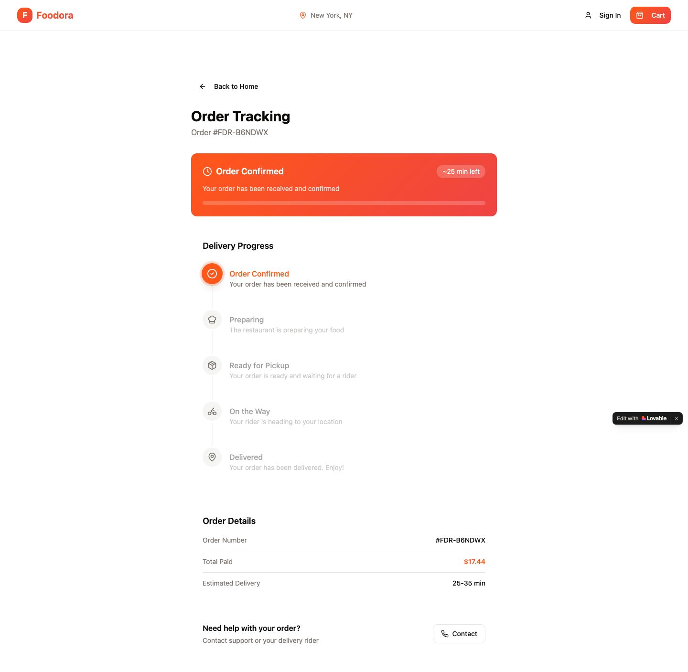 |

---

## FD-08 · Page not found

**As a customer who followed a broken link, I want to find my way back, so that I do not give up.**

- Any address that is not a Foodora page shows **404 — Page not found** and a **Return to Home**
  link.

---

## Not in scope

- **Signing in** (`/auth`). The page exists, but ordering never requires an account, and it is not
  part of this workshop. [Screenshot](screens/15-auth.jpg).
- Paying for real, changing the delivery location in the header, and anything a restaurant sees.
